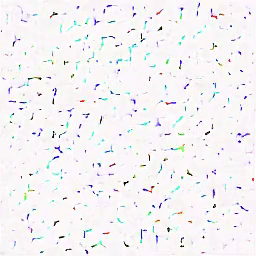
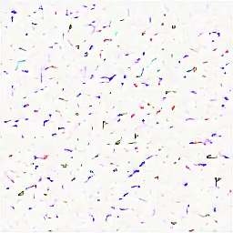
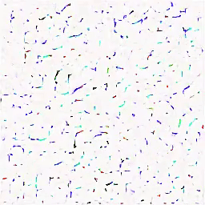
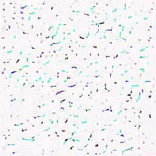

Official implementation of SketchMol.

  
  
  
  
  

# Installation
	git clone https://github.com/WangZiXubiubi/SketchMol-v1.git
	cd SketchMol-v1
	pip install -r requirements.txt
	conda activate sketchmol

## Example: Sample from molecule property logp=2.5 TPSA=70 (Supports up to 7 attributes LogP, QED, MW, TPSA, HBD, HBA, RB)
	CUDA_VISIBLE_DEVICES=<gpu_ids> python scripts/sample_diffusion_condition_continuousV2.py -p "LogP:2.5 TPSA:70" -r /path/model.ckpt
## Example: Inpaint molecule MW=500
	CUDA_VISIBLE_DEVICES=<gpu_ids> python scripts/inpaint_continuousV2.py -p "MW:500" -r /path/model.ckpt --validation_dataset /path/example_inpaint.csv --mask_from_where mol_various_preset
#### Batch conversion from images: The image recognition tool used in this work comes from MolScribe:github.com/thomas0809/MolScribe. We provide a method for batch recognition from CSV. Please use the ckpt provided by MolScribe for recognition. Thanks for their excellent work.
	CUDA_VISIBLE_DEVICES=<gpu_ids> python evaluate/predict_csv.py --model_path ./ckpt_from_molscribe/swin_base_char_aux_200k.pth --image_path path_to_your_generated_csv.csv
#### Evaluate the generated results (input the csv path this file)
 	python evaluate/low_quality_image_various_condtion_continuousV2.py
 
# Train your own SketchMol
## Stage0: Create images (by RDKit) 
#### It is recommended to increase the number of CPUs by adjust --num_workers to accelerate the generation process. Please input the path where you want to save the training images.
	python ./data_process/mp_mol_image_generation_for_diffusion.py --num_workers 10 --path_ori path_to_your_directory # image generation
	python ./data_process/mp_scaffold_ori_generation.py --num_workers 10 --path_ori path_to_your_directory # you can also generate scaffold images 
 	python ./data_process/mp_convert_valid_to_invalid.py --num_workers 10 --path_ori path_to_your_directory # Use random deletion of parts of the image structure to construct an invalid image for the first stage of training.
  	python ./data_process/calculate_property.py --path_csv path_to_your_csv # calculate various physichemical properties
## Stage1: Train autoencoder 
	CUDA_VISIBLE_DEVICES=<gpu_ids> python main.py --base configs/autoencoder/autoencoder_kl_pubchem400w_32x32x4.yaml -t --gpus 0,
## Stage2: Train diffusion model (don't forget load the autoencoder ckpt in yaml)
	CUDA_VISIBLE_DEVICES=<gpu_ids> python main.py --base configs/ld_molecules/pubchem400w_conditional_various_continuous_32x32x4.yaml -t --gpus 0,
## Stage3: Adjust diffusion model (RLME, Provide molecules that do not meet the expectations for fine-tuning the diffusion model. ）
### This is the process in the article for physichemical-constrained molecular generation. You can adjust this process according to the tasks you expect. It is not necessary to integrate external models into the diffusion model; it is sufficient for the external models to provide assessments only.
	# 1. sample some images from current model
	CUDA_VISIBLE_DEVICES=<gpu_ids> python scripts/sample_diffusion_condition_continuousV2.py -r /path/model.ckpt --conditional_count 40 --condition_type mol_various_validation_from_dataset --proerty_num 3

  	# Finding unsuitable molecular images
   	# 2. extract molecule from images
	CUDA_VISIBLE_DEVICES=<gpu_ids> python evaluate/predict_csv.py --model_path ./ckpt_from_molscribe/swin_base_char_aux_200k.pth --image_path path_to_your_generated_csv.csv 
 	# 3. evaluate properties: paste the csv into evaluate/low_quality_image_various_condtion_continuousV2.py
  	python evaluate/low_quality_image_various_condtion_continuousV2.py # output csv containing all the unsuitable ones. 
   
   	# 4. adjust the diffusion model: paste the csv into sampled_invalid_image_path in the yaml (dataset class) & finetune the model (1-2 times is enough)
	###
 	train:
		#target: ldm.data.pubchemdata.pubchem400wTrain_various_continuousV2
		params:
			size: 256
			sampled_invalid_image_path: path_to_your_undesired_images.csv
   	###
	CUDA_VISIBLE_DEVICES=<gpu_ids> python main.py --base configs/ld_molecules/pubchem400w_conditional_various_continuous_32x32x4.yaml -t --gpus 0,

#### Some of the code is built from LDM:github.com/CompVis/latent-diffusion & MolScribe:github.com/thomas0809/MolScribe. The line segment detection tool is from: github.com/primetang/pylsd. Thanks for their excellent work. 

# Contact
If you have any questions, please feel free to contact s2230167@u.tsukuba.ac.jp (Zixu Wang).

# License
This project is licensed under the MIT License - see the [LICENSE.md](LICENSE.md) file for details.
